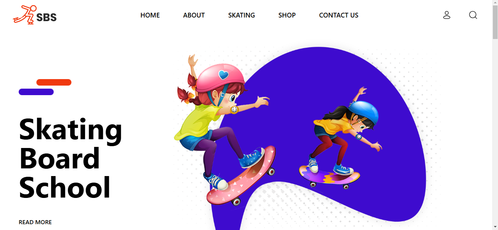
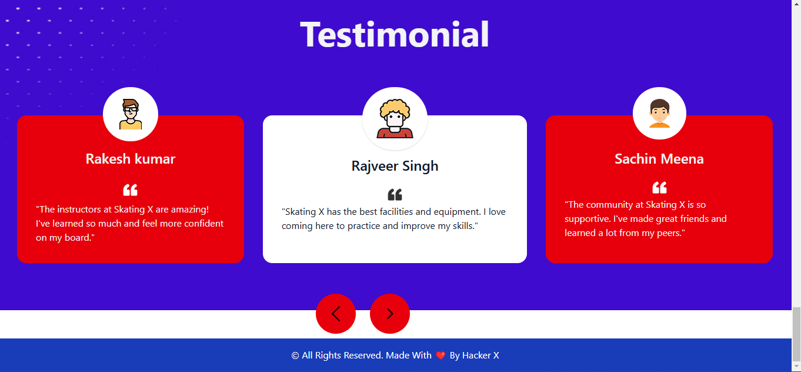

# 🛹 Skating Board School

Welcome to **Skating Board School**! Your ultimate destination to learn and master the art of skateboarding. 🛹

## 🏫 About the Project

Skating Board School is a modern and engaging website designed to provide comprehensive information about our skateboarding classes, shop, and community. With a user-friendly interface and vibrant design, learning to skate has never been more exciting!

## 🖼️ Features

- **Skating Classes**: Explore a variety of classes designed for all skill levels, from beginners to advanced skaters.
- **About Us**: Learn about our mission and the passionate instructors behind Skating X.
- **Skating Videos**: Watch our talented skaters in action and get inspired.
- **Skate Shop**: Discover a wide range of skateboarding gear and accessories.
- **Testimonials**: Read what our students have to say about their experiences at Skating X.
## 🌐 Live Demo

The website is live! You can visit it at [Skating Board School Live](http://sbs.netlify.app) to see it in action.

## 📸 Screenshots




## 🚀 Getting Started

To get started with Skating Board School, follow these steps:

1. **Clone the repository**:
    ```sh
    git clone https://github.com/ishwar-meena/skating-board-school.git
    ```

2. **Navigate to the project directory**:
    ```sh
    cd skating-board-school
    ```

3. **Install dependencies**:
    ```sh
    npm install
    ```

4. **Run the development server**:
    ```sh
    npm start
    ```

5. **Open your browser** and visit `http://localhost:3000` to see the website in action!

## 🛠️ Built With

- **React**: For building the user interface.
- **Tailwind CSS**: For styling and layout.
- **JavaScript**: For interactivity.
- **Vite**: For fast and optimized development.

## 📄 License

This project is licensed under the MIT License - see the LICENSE file for details.

---

Happy Skating! 🛹🎉